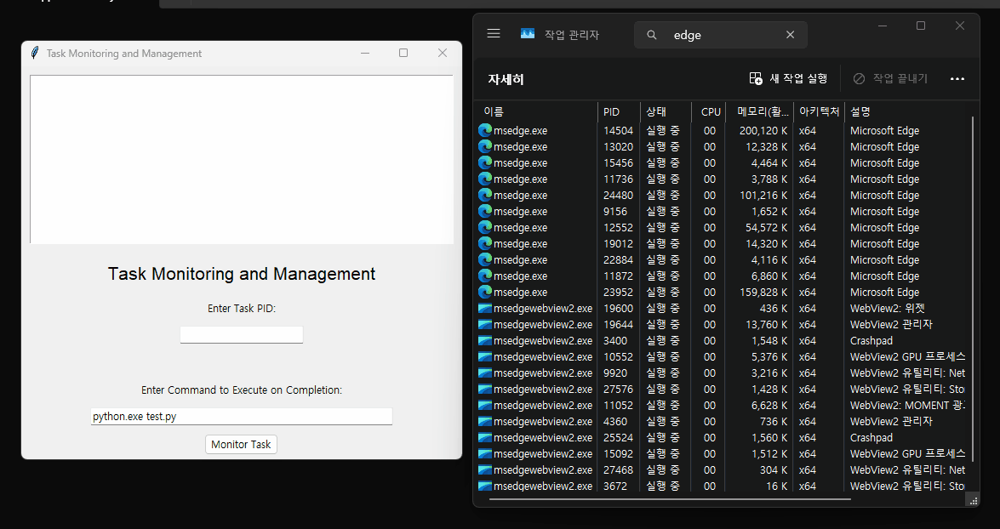

# Process Monitor
Have you ever experienced long installation or compilation times that prevent you from running other processes or jobs?

Here is the solution! Monitor-and-Run is a program that automatically executes a second process after the completion of an installation or compilation.

Simply enter the PID of the long-running task and the command you want to run next.

We provide both GUI and CUI versions of the program.

## How to use?

### CUI

```
-p --pid: PID of the process to monitor

-e --execute: Command to execute after process completion

-v --version: Show program version
```

### GUI




## Example Use Case

- Automatically shut down your computer after an installation is complete.
 *(That's Why I made this program!)*